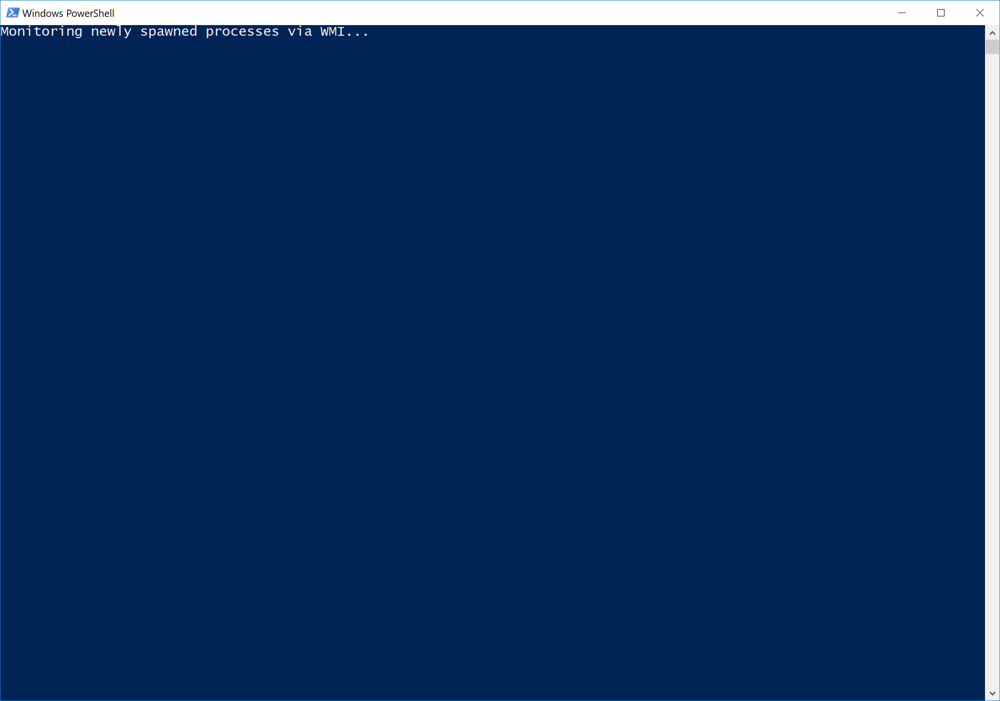

# ProcessBouncer
ProcessBouncer is a PoC for blocking malware with a process-based approach. With a little fine-tuning this allows to effectively block most of current ransomware that is out there.

_author:_ Holger Junker ([@HolgerJunker](https://twitter.com/HolgerJunker)) ([seculancer.de](http://www.seculancer.de))

## IMPORTANT: CHECK BEFORE USAGE!!!

PLEASE READ THE COMPLETE FILE BEFORE USING PROCESS BOUNCER. CHECK FOR ALL COMMENTS CONTAINING "CONFIG!" AND CHECK FOR THE OPTIONS THAT CAN BE DE-/ACTIVATED BY COMMENTING THE APPROPRIATE LINES IN THE SCRIPT.

### ExecutionPolicy and Run as...
Depending on your Windows version and various settings it might be necessary to run ProcessBouncer with Administrator's priviledges. If you run into the situation that you are not allowed running (unsigned) powershell scripts. Try running powershell as Administrator and type:
	Set-ExecutionPolicy Unrestricted
	...and confirm the dialogue.
Please refer to https://docs.microsoft.com/en-us/powershell/module/microsoft.powershell.security/set-executionpolicy?view=powershell-6 for further information.

### Sign your customized ProcessBouncer script
No matter whether you run ProcessBouncer as Administrator or a regular user, you should configure your windows system(s) to execute only signed powershell scripts.

TODO: Well, I am gonna have to document this soon, maybe based on a writeup like this one: https://www.scriptinglibrary.com/languages/powershell/how-to-sign-a-powershell-script/

## Technical details
While this script is running (no admin permissions shall be required) this should protect the user from typical ransomware infections. This is accomplished by using _Windows Management Instrumentation (WMI)_ to get notified (asynchronously get events) on newly started processes and check some of their characteristics for things that are probably of malicious nature. There are various options to choose and to extend for making the script work best. Please check and tune the included white- and blacklists carefully. Once a process is rated as suspicious it is suspended / terminated (CONFIG!). A GUI popup is shown to the user to inform him that it might be the time to take his hands of his keyboard and call the IT department. If you configure Process Bouncer to only suspend the suspicious process, you can e.g. set up a remote-session and check the process that is still running... and hey... you are on the front line of cyber defense... and you are winning!

## Limitations

Because Process Bouncer relies on WMI to get information about newly spawned processes, it will not be able to suspend extremely _short-lived processes_ (processes which only execute for a split second, e.g. Windows' _whoami.exe_). PsC is not involved in the process creation logic, it relies on 
WMI events which are only generated once the process has already been launched. There are methods to get synchronously involved in the process creation logic (e.g. by using the _PsSetCreateProcessNotifyRoutine kernel API_), but this is out of scope for this Powershell tool :-).

## Run ProcessBouncer with default configuration

Simply running ProcessBouncer without customization might leave some risks and make you prone to false positives. But you can give it a try - preferably on a virtual test system that is not connected to production systems.

  

## Customization
Well, if you have gone through the steps of initial configuration / customization (the lines with comments containing CONFIG! - you remember?!) you should have a basic idea for further enhancements and customizations that especially meet the requirements and specifics of your infrastructure. You might want to exclude further paths from being able to execute processes. There might be individual applications that require some whitelisting. There is way more to work on here. Please feel welcome to get back to me with feedback and suggestions for further improvements. Twitter @HolgerJunker is a good way to catch me.

# Donate to support the further development and improvement of ProcessBouncer
The greatest help is to give feedback to me. Send me your ProcessBouncer.log files, ask questions or suggest features on GitHub, let me know about additions you have made to config and/or code. THX!

You have been saved from a malware infection thanks to ProcessBouncer? Please feel free to give a spare dime/dollar/euro/... or two... It will be used to further enhance ProcessBouncer.

You can also support ProcessBouncer by donating hardware to keep operative backend and development systems running. Please take a look at (my list on, [amazon](https://www.amazon.de/hz/wishlist/ls/2FD1Z75K43I7M?ref_=wl_share))

## License and Credits
license: this script is published under GPLv3 - please feel free to use and improve it.

logo: © Can Stock Photo / Tribalium

technical credits: the initial implementation was re-done based on the great script Process Spawn Control (PsC, [website](https://github.com/felixweyne/ProcessSpawnControl)) from Felix Weyne in 2018.

musical credits: the work based on Felix's code was mainly done while listening to the great music of Mono Inc (e.g. Children of the Dark or Voices of Doom).
