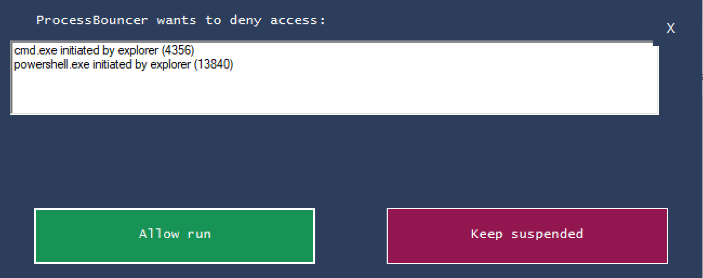

# ProcessBouncer
ProcessBouncer is a PoC for blocking malware with a process-based approach. With a little fine-tuning this allows to effectively block most of current ransomware that is out there.

## Run ProcessBouncer with default configuration
IMPORTANT: Please read this entire README file before using ProcessBouncer. Check the section marked "1. settings (CONFIG section)" of processbouncer.ps1 for adjusting ProcessBouncer to your individual needs. The configuration in this section is pretty self-explanatory.

ProcessBouncer is basically a powershell script. Simply run processbouncer.ps1 to get started.

The powershell window you see will fill up with information on newly spawned processes over time.

An alert pops up when a new process is created that ProcessBouncer categorizes as suspicious.

The user can then see some further information and (if he is allowed to by the admin's configuration/customization) make a decision on running / suspending / terminating the process.

Simply running ProcessBouncer without customization might leave some risks and make you prone to false positives. But you can give it a try - preferably on a virtual test system that is not connected to production systems.

### ExecutionPolicy and Run as...
Depending on your Windows version and various settings it might be necessary to run ProcessBouncer with Administrator's priviledges. If you run into the situation that you are not allowed running (unsigned) powershell scripts. Try running powershell as Administrator and type:
	Set-ExecutionPolicy Unrestricted
	...and confirm the dialogue.
Please refer to https://docs.microsoft.com/en-us/powershell/module/microsoft.powershell.security/set-executionpolicy?view=powershell-6 for further information.

### Enable Writing to Windows EventLog
In order to enable ProcessBouncer to write to the windows EventLog, execute the following command as administrator:

New-EventLog -LogName ProcessBouncer -Source "ProcessBouncer"

You may choose an individual LogName, but remember to change $logname in the powershell script.

### Sign your ProcessBouncer script
No matter whether you run ProcessBouncer as Administrator or a regular user, you should 
allow your windows system(s) to execute only signed powershell scripts.

TODO: Well, I am gonna have to document this soon, maybe based on a writeup like this one: https://www.scriptinglibrary.com/languages/powershell/how-to-sign-a-powershell-script/

### co-existence with other security software
ProcessBouncer is mainly tested in combination with Windows Defender.

Problems have been reported to me when using Symantec or TrendMicro. One solution to this can be to whitelist the ProcessBouncer Powershell script in your anti-virus software.

## Technical details
While this script is running (no admin permissions shall be required) this should protect the user from typical ransomware infections. This is accomplished by using _Windows Management Instrumentation (WMI)_ to get notified (asynchronously get events) on newly started processes and check some of their characteristics for things that are probably of malicious nature. There are various options to choose and to extend for making the script work best. Please check and tune the included white- and blacklists carefully. Once a process is rated as suspicious it is suspended / terminated. A GUI popup is shown to the user to inform him that it might be the time to take his hands of his keyboard and call the IT department. If you configure Process Bouncer to only suspend the suspicious process, you can e.g. set up a remote-session and check the process that is still running... and hey... you are on the front line of cyber defense... and you are winning!

### Limitations

Because Process Bouncer relies on WMI to get information about newly spawned processes, it will not be able to suspend extremely _short-lived processes_ (processes which only execute for a split second, e.g. Windows' _whoami.exe_). PsC is not involved in the process creation logic, it relies on 
WMI events which are only generated once the process has already been launched. There are methods to get synchronously involved in the process creation logic (e.g. by using the _PsSetCreateProcessNotifyRoutine kernel API_), but this is out of scope for this Powershell tool :-).

### Customization
Well, if you have gone through the steps of initial configuration / customization (the config section mentioned earlier - you remember?!) you should have a basic idea for further enhancements and customizations that especially meet the requirements and specifics of your infrastructure. You might want to exclude further paths from being able to execute processes. There might be individual applications that require some whitelisting. There is way more to work on here. Please feel welcome to get back to me with feedback and suggestions for further improvements. Twitter @HolgerJunker is a good way to catch me.

Share your ideas! Here are some of mine...
- One optional feature I have been thinking about is to use functions of MS Defender.
- why not keep track of file access as an additional way of finding suspicious parameters (this looks more on ransomware already installed instead of the initial infection vector).
- ProcessBouncer might soon include an option to make some improvement to windows settings (registry keys, AttackSurfaceReductionRules, ...) when ProcessBouncer is started.
- Self-defence of ProcessBouncer might also make sense.

### implement your own statistics endpoint
In order to collect statistics data for findings of ProcessBouncer you can make use of the mechanism already implemented. I save this data in a simple good old relational DB.

## License and Credits
license: this script is published under GPLv3 - please feel free to use and improve it.

_author:_ Holger Junker ([@HolgerJunker](https://twitter.com/HolgerJunker))

logo: © Can Stock Photo / Tribalium

technical credits: the initial implementation was re-done based on the great script Process Spawn Control (PsC, [website](https://github.com/felixweyne/ProcessSpawnControl)) from Felix Weyne in 2018.

Please also take a look at [ProcessBouncerService](https://github.com/Rotrixx/ProcessBouncerService) - an implementation of the same approach but as a windows service instead of a powershell script created by [@r0trixx](https://twitter.com/r0trixx) during his internship at my workplace in BSI.

musical credits: the work based on Felix's code was mainly done while listening to the great music of Mono Inc (e.g. Children of the Dark or Voices of Doom).
